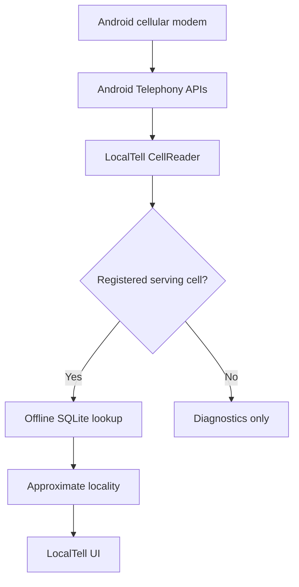
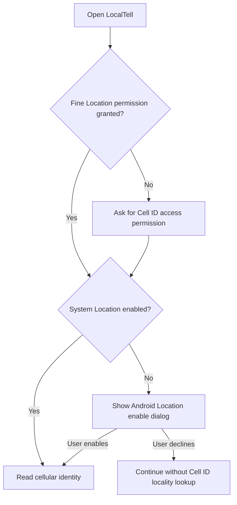
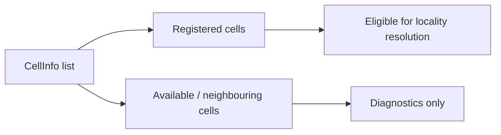
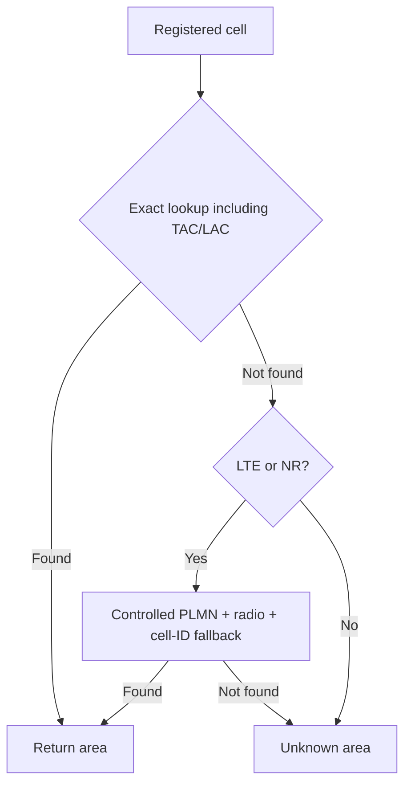
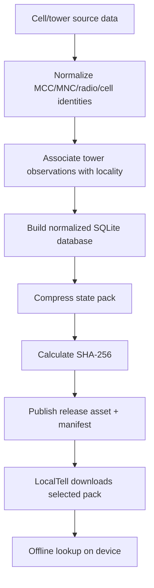
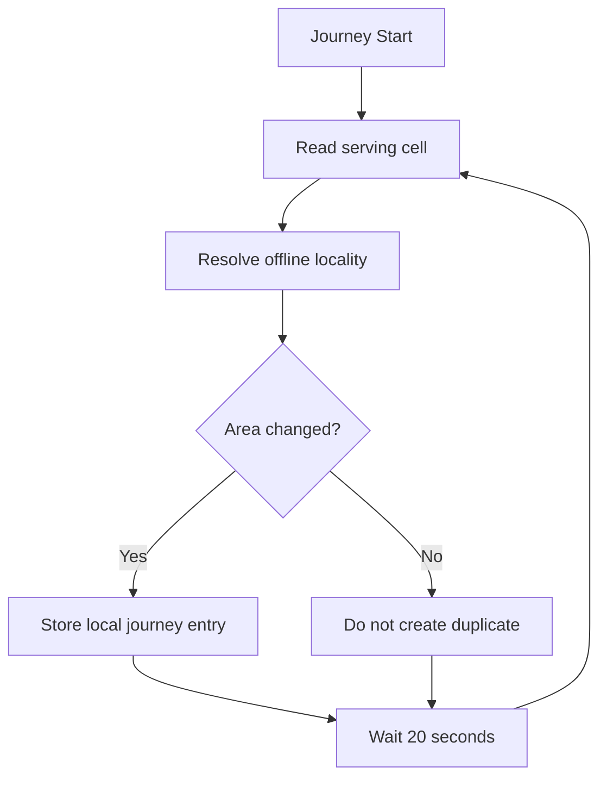
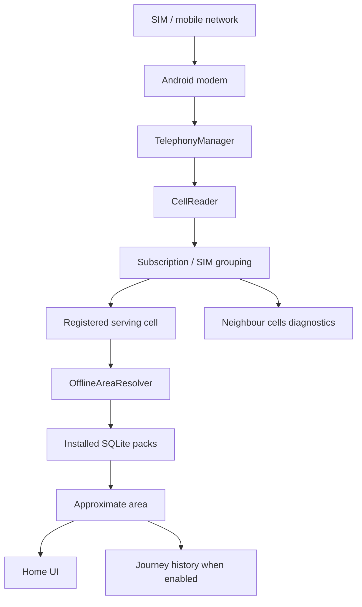

# How LocalTell Will Show a Local Area on Modern Android

## Purpose

LocalTell aims to recreate the useful experience of older phones that could show a local area from the cellular network, while working within modern Android privacy restrictions.

The design goal is:

> Show an **approximate locality** from the phone's serving cellular identity using an **offline database**, without LocalTell requesting GPS coordinates and without requiring internet for normal lookup.

---

## 1. Core idea

A modern Android phone already communicates with cellular infrastructure. When Android permits access, LocalTell can read values such as:

```text
Radio technology
MCC
MNC
PLMN
TAC / LAC
Cell ID / ECI / NCI
Signal strength
Registered / available status
```

LocalTell then searches an offline SQLite database that maps the serving cellular identity to an approximate area.



---

## 2. What normal LocalTell lookup does not require

Normal locality lookup is designed not to require:

- GPS/GNSS coordinates;
- internet access;
- Google Maps;
- a remote reverse-geocoding API;
- uploading the user's cell identity to a LocalTell server.

Internet is needed only when the user chooses to download or update an offline data pack.

---

## 3. Why Android Location still has to be enabled

Android considers cellular identifiers location-sensitive because they can be used to infer approximate position.

Therefore Android may require:

```text
ACCESS_FINE_LOCATION permission
        +
Android system Location switch enabled
```

before detailed Cell ID information is exposed.

This is an **Android privacy gate**. LocalTell does not need to call GPS/GNSS APIs or retrieve latitude/longitude for its core feature.

The intended flow is:



The Location-enablement helper is only used to resolve the system setting. It is not used to start coordinate tracking.

---

## 4. Dual-SIM handling

Modern phones frequently have two active SIMs. LocalTell should not assume all returned cellular information belongs to one SIM.

The UI can present:

```text
All SIMs

SIM 1 · Carrier A
  Radio
  MCC / MNC / PLMN
  TAC / LAC
  Cell ID / NCI
  Signal

SIM 2 · Carrier B
  Radio
  MCC / MNC / PLMN
  TAC / LAC
  Cell ID / NCI
  Signal
```

At a high level:

```text
SubscriptionManager
        ↓
active subscription
        ↓
TelephonyManager.createForSubscriptionId(...)
        ↓
cell diagnostics for that subscription
```

`READ_PHONE_STATE` is optional and is used for SIM-slot/carrier diagnostics. Core generic Cell ID lookup should continue to work when that optional permission is not granted.

LocalTell does not need phone number, IMEI, IMSI, ICCID, contacts, or similar identifiers.

---

## 5. Serving cell versus neighbouring cells

Android can return multiple `CellInfo` records. Some may be marked as registered while others are available/neighbouring cells.



LocalTell's rule is:

```text
Registered cell
→ eligible for locality resolution

Unregistered / neighbouring cell
→ diagnostics only
```

This prevents a nearby but non-serving cell from being presented as the user's current locality.

---

## 6. Offline SQLite database

Conceptually, an offline pack contains normalized area and cell lookup data.

```text
area
----
id
area_name
district
state

cell_lookup
-----------
mcc
mnc
radio
area_code
cell_id
area_id
confidence
```

The lookup key is based on network context, not Cell ID alone:

```text
MCC + MNC + Radio + TAC/LAC + Cell ID
                    ↓
               Area record
                    ↓
          Human-readable locality
```

This helps avoid collisions between different operators and radio technologies.

---

## 7. Why MCC/MNC/PLMN matter

A Cell ID is not globally unique by itself.

```text
MCC = Mobile Country Code
MNC = Mobile Network Code
PLMN = MCC + MNC
```

Combined with radio technology and cell/area identifiers, these values provide the network context needed for reliable lookup.

LocalTell normalizes MCC/MNC values so Android strings and numeric source datasets can match consistently.

---

## 8. Radio technologies

| Android radio | LocalTell label | Area identifier | Cell identifier |
|---|---|---|---|
| GSM | GSM | LAC | CID |
| WCDMA / 3G | WCDMA | LAC | CID |
| LTE / 4G | LTE | TAC | CI / ECI |
| NR / 5G | NR | TAC | NCI |
| TD-SCDMA where available | TDSCDMA | LAC | CID |

The exact values available depend on the phone, Android version, modem, operator, and network deployment.

---

## 9. Exact and fallback lookup

The preferred lookup uses every available identifier:

```text
MCC
MNC
Radio
TAC/LAC
Cell ID
```

For LTE/NR, LocalTell can use a controlled fallback when the area code differs but the PLMN-scoped cell identity still matches a known record.



Exact matches should be preferred, and the result can carry a confidence value.

---

## 10. Offline data packs

LocalTell does not need to bundle an entire nationwide tower database in every APK.

A manifest can advertise optional packs:

```text
manifest.json
    ├── Tamil Nadu
    ├── Karnataka
    ├── Kerala
    └── India (possible future option)
```

Each pack can provide metadata such as:

```text
pack ID
name
version
download URL
SHA-256 checksum
compressed size
uncompressed size
```

The app downloads a selected pack, validates it, stores it locally, and then performs normal locality lookup completely offline.

---

## 11. Data-generation pipeline

The app and the data-generation process are separate.



A properly licensed cell/tower dataset can provide radio observations. Geographic data can be used during pack generation to assign a human-readable area.

The runtime app does not need to reverse-geocode coordinates.

---

## 12. Example runtime flow

Suppose Android exposes:

```text
Radio: NR
MCC: 405
MNC: 869
PLMN: 405-869
TAC: 89
NCI: 4367237120
Signal: -103 dBm
Registered: Yes
```

LocalTell performs approximately:

```text
405 + 869 + NR + 89 + 4367237120
                ↓
          offline SQLite
                ↓
           matching area
                ↓
       Approximate area name
```

If the cell is not in an installed pack, the UI shows **Unknown area** while still showing the raw cellular diagnostics.

---

## 13. Normal Home behavior

Home is not intended to continuously poll the device.

```text
App opens
   ↓
Read current cellular identity
   ↓
Resolve from installed pack
   ↓
Display result

User taps Refresh
   ↓
Read again
```

This keeps normal usage lightweight.

---

## 14. Journey mode

Journey mode is explicitly user-started continuous monitoring.

Current intended polling interval:

```text
20 seconds
```

The service resolves the registered cell and stores a new journey entry only when the resolved locality changes.



Journey runs as a foreground service so the user is aware that continuous monitoring is active and can stop it at any time.

---

## 15. Journey notification states

The notification should distinguish these states accurately:

```text
No cellular identity available
```

```text
Available neighbouring cells; no serving cell
```

```text
Cell detected; locality not in installed offline packs
```

```text
Approx. area: <resolved area>
```

---

## 16. Privacy model

### Normal lookup

Cell identity is read from Android and resolved locally. The design does not require uploading Cell ID or resolved locality to a LocalTell server.

### GPS

LocalTell does not need to call GPS/GNSS APIs or retrieve latitude/longitude for its core functionality.

Android's Location permission/system switch is required because Android itself classifies Cell ID as location-sensitive information.

### Journey

When the user explicitly starts Journey mode, LocalTell may store resolved locality changes **locally on the device** for journey history.

The intended model is:

```text
local processing
local storage
no automatic upload
```

The user should be able to clear journey history.

---

## 17. Battery behavior

There is an important difference between:

```text
Android Location switch = ON
```

and:

```text
an app continuously requesting GPS fixes
```

The Location switch being enabled does not mean LocalTell is continuously using GPS.

Normal Home use reads cellular identity only when needed. Journey performs periodic work every 20 seconds because the user intentionally enabled continuous tracking.

---

## 18. Why internet can be off

Once a pack is installed, normal lookup is local:


Therefore LocalTell can work when Wi-Fi is off and mobile data is off, as long as the phone still has cellular service, Android exposes the cell identity, and the required offline pack is installed.

---

## 19. Nokia 1100 versus LocalTell

| Aspect | Nokia 1100 style | LocalTell |
|---|---|---|
| Platform | GSM feature phone | Android smartphone |
| Human-readable area source | Network/operator service | Local offline database |
| GPS coordinates | Not required | Not requested by LocalTell |
| Internet for normal lookup | No | No |
| Cell identity access | Built into phone/network firmware | Android Telephony APIs |
| Privacy gate | Feature-phone/network model | Android permissions + Location switch |
| Dual SIM | Typically not applicable to Nokia 1100 | Explicit subscription handling |
| Data updates | Operator/network controlled | Downloadable LocalTell packs |
| Journey history | Not the same feature | Optional user-started local history |

---

## 20. Architecture summary



The modern equivalent is therefore:

```text
cellular network context
        ↓
technical serving-cell identity
        ↓
offline locality mapping
        ↓
human-readable approximate area
```

---

## 21. Current implementation status

The Android app already demonstrates that serving-cell values such as the following can be read without internet once Android's required privacy conditions are satisfied:

```text
NR / LTE / other radio
PLMN
TAC / LAC
Cell ID / NCI
Signal level
```

The remaining major data-side work is to create and publish the real locality packs and validate Cell ID → locality resolution across operators and regions.

---

## 22. Design principle

LocalTell should always describe the result as an **approximate area**, not an exact position.

A cellular serving cell is radio infrastructure, not a GPS coordinate.

LocalTell is intended to answer:

> Roughly which locality is my phone currently connected through?

not:

> What is my exact physical address?

---

## References

### Android

- Android `TelephonyManager`  
  https://developer.android.com/reference/android/telephony/TelephonyManager
- Android `SubscriptionManager`  
  https://developer.android.com/reference/android/telephony/SubscriptionManager
- Android location-settings resolution  
  https://developer.android.com/develop/sensors-and-location/location/change-location-settings

### Historical inspiration

- Nokia 1100 User Guide — Cell info display  
  https://www.manualslib.com/manual/111915/Nokia-1100.html?page=26

---

## Project

LocalTell repository:  
https://github.com/actionanand/local-tell
