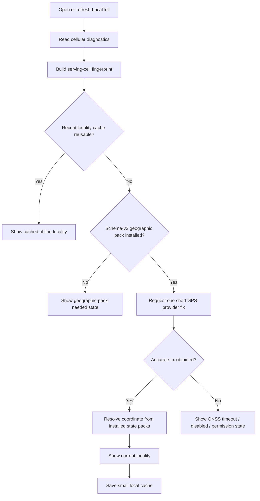
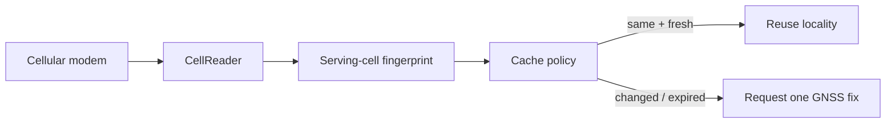
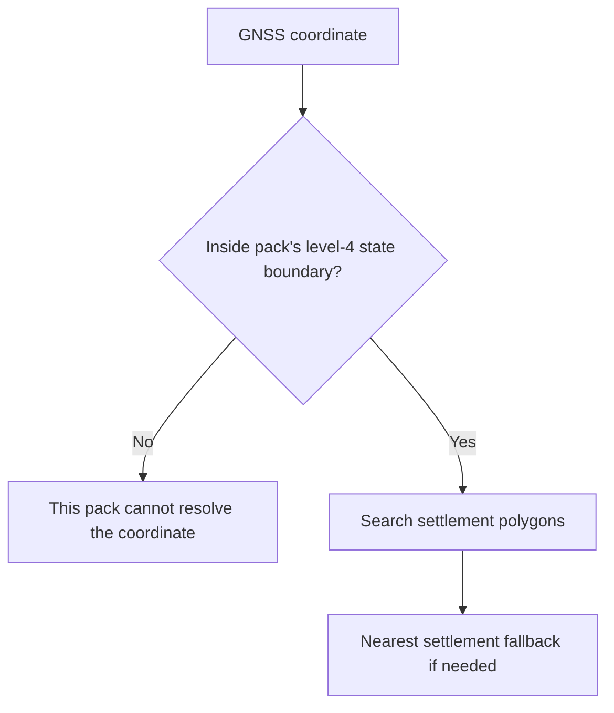
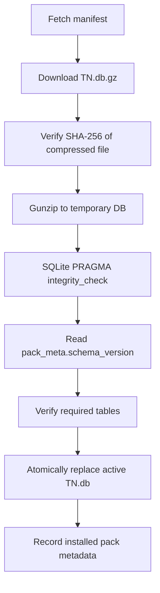
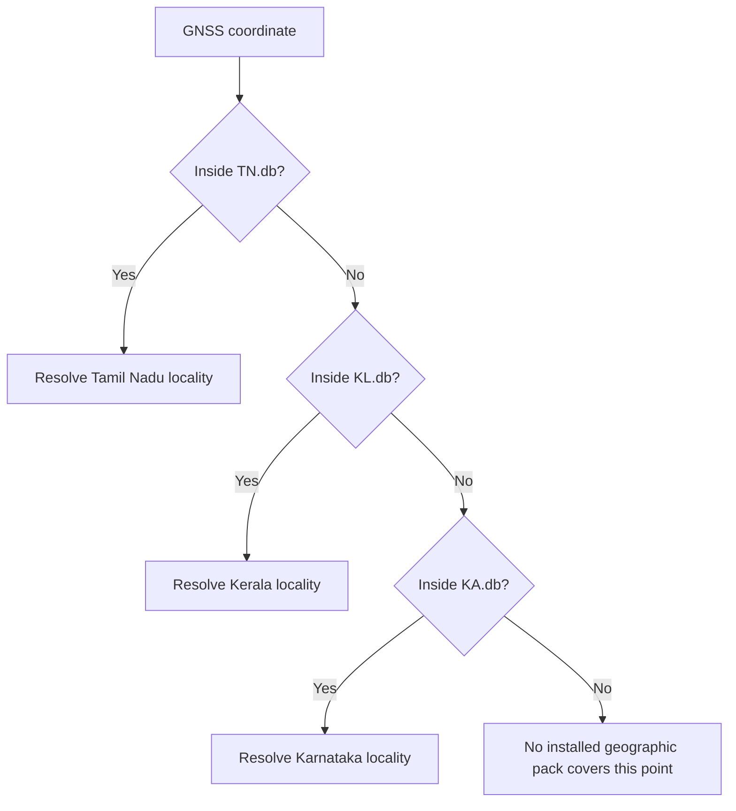
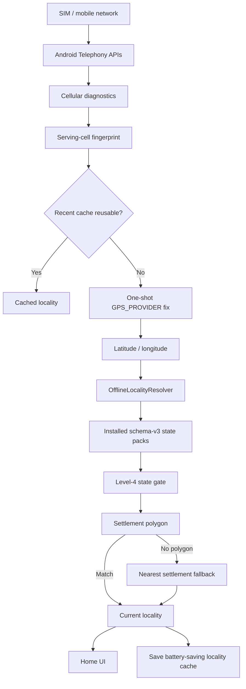

# How LocalTell Shows a Locality on Modern Android

## Purpose

LocalTell recreates the useful experience of older phones that displayed a human-readable local area, but it does so using an architecture that is practical on modern Android.

The current design goal is:

> Show the phone's **current locality** offline by combining a short on-device GNSS fix with a downloaded geographic SQLite pack, while using cellular information as a low-power cache/change signal and as diagnostics.

The important architectural change is:

```text
Old experimental design
-----------------------
Cell ID / NCI
    ↓
cell-to-tower/locality database
    ↓
approximate area


Current schema-v3 design
------------------------
Cellular fingerprint
    ↓
cache reuse / change signal
    ↓
short on-device GNSS fix when needed
    ↓
latitude + longitude
    ↓
offline geographic state pack
    ↓
current locality
```

LocalTell no longer depends on maintaining an all-India database of every active Cell ID.

---

## 1. Core idea

Modern cellular networks change continuously. New LTE and 5G cells can appear, identifiers can change, and no public Cell-ID source provides complete, consistently current nationwide coverage.

Therefore LocalTell's production-oriented locality architecture is now **GNSS-first and offline-geography-based**.


```mermaid
flowchart TD
    A[Open or refresh LocalTell] --> B[Read cellular diagnostics]
    B --> C[Build serving-cell fingerprint]
    C --> D{Recent locality cache reusable?}
    D -->|Yes| E[Show cached offline locality]
    D -->|No| F{Schema-v3 geographic pack installed?}
    F -->|No| G[Show geographic-pack-needed state]
    F -->|Yes| H[Request one short GPS-provider fix]
    H --> I{Accurate fix obtained?}
    I -->|Yes| J[Resolve coordinate from installed state packs]
    I -->|No| K[Show GNSS timeout / disabled / permission state]
    J --> L[Show current locality]
    L --> M[Save small local cache]
```

The phone's physical coordinate is used only on-device for locality resolution. LocalTell does not need a remote reverse-geocoding service.

---

## 2. What LocalTell is trying to answer

The current feature answers:

> Which locality is this phone physically in?

It does **not** primarily answer:

> Which locality contains the serving mobile tower?

Those two concepts can differ significantly.

A phone can connect to a tower several kilometres away, especially in rural areas, hills, coastlines, or sparse network deployments.

The schema-v3 design therefore uses the phone's GNSS position rather than assuming the serving tower represents the user's physical locality.

---

## 3. Role of cellular information

Cellular information remains important, but it is no longer the main geographic lookup key.

LocalTell can read values such as:

```text
SIM / subscription
MCC
MNC
PLMN
Radio technology
TAC / LAC
Cell ID / ECI / NCI
PCI
ARFCN / NRARFCN
Signal strength
Registered / available status
```

For the current schema-v3 Home flow, cellular data serves three purposes:

1. display useful radio/network diagnostics;
2. identify the current serving-cell environment;
3. decide whether a recently resolved locality can be reused without starting GNSS again.


```mermaid
flowchart LR
    A[Cellular modem] --> B[CellReader]
    B --> C[Serving-cell fingerprint]
    C --> D[Cache policy]
    D -->|same + fresh| E[Reuse locality]
    D -->|changed / expired| F[Request one GNSS fix]
```

The geographic result itself comes from:

```text
GNSS coordinate + installed geographic pack
```

not from:

```text
Cell ID → location database
```

---

## 4. Current serving-cell fingerprint

The current Android implementation creates a `CellularFingerprint` from the preferred registered serving cell.

The fingerprint contains:

```text
subscriptionId
MCC
MNC
radio
areaCode
cellId
```

The current implementation chooses from registered cells and prefers NR, then stronger signal.

This fingerprint is used only for cache reuse. It is **not** treated as geographic truth.

A future optimization may intentionally use a less volatile fingerprint such as PLMN + TAC for some cache decisions, but the current implementation includes the exact serving `cellId`.

---

## 5. Locality cache policy

Starting GNSS on every refresh would waste battery.

LocalTell therefore keeps a small local cache. A cached locality can currently be reused only when all of these are true:

```text
cached locality exists
AND
current serving-cell fingerprint exists
AND
current fingerprint == cached fingerprint
AND
cached result is no older than 15 minutes
AND
the exact geographic pack ID/version is still installed
```

Current maximum cache age:

```text
15 minutes
```

This cache is a battery optimization only. It is **not** a Cell-ID-to-location database.

---

## 6. GNSS behavior

When the cache cannot be reused and a schema-v3 geographic pack is available, LocalTell requests a short GNSS fix.

Current implementation:

```text
Provider:
Android GPS_PROVIDER

Required permission:
ACCESS_FINE_LOCATION

Maximum accepted accuracy:
50 metres

Timeout:
25 seconds
```

The listener is removed on successful fix, timeout, cancellation, provider disable, permission failure, or error.

Normal Home lookup therefore does **not** continuously track the user's position.

---

## 7. Android Location permission and Location switch

LocalTell currently requires Android's location controls for two reasons:

1. Android protects detailed cellular identifiers as location-sensitive data.
2. LocalTell needs a short GNSS fix for schema-v3 locality resolution.

The current Home flow expects:

```text
ACCESS_COARSE_LOCATION
+
ACCESS_FINE_LOCATION
+
Android system Location switch enabled
```

The app requests coarse + fine together and uses fine access for the GNSS fix.

---

## 8. Privacy model

### 8.1 GNSS coordinate

LocalTell **does access an on-device GNSS coordinate when a fresh locality is required**.

```text
GNSS coordinate
      ↓
processed locally
      ↓
offline TN.db / other state pack
      ↓
locality result
```

The coordinate does not need to be sent to Google Maps, a LocalTell server, Nominatim, a remote reverse-geocoder, or a cell-location service.

### 8.2 Internet

Internet is used for optional data-pack operations such as downloading the manifest, downloading a state pack, and updating a state pack.

Normal coordinate-to-locality lookup happens locally after the required pack has been installed.

### 8.3 Cellular identity

Cellular diagnostics are read locally. The schema-v3 Home locality resolver does not upload the serving Cell ID to determine geography.

### 8.4 Local cache

A recent resolved locality, its pack metadata, accuracy, timestamp, and serving-cell fingerprint are stored locally to reduce unnecessary GNSS requests.

---

## 9. Offline operation

Once the required geographic pack is installed:

```text
Wi-Fi OFF
Mobile data OFF
Android Location ON
      ↓
GPS satellites
      ↓
on-device coordinate
      ↓
local SQLite geographic pack
      ↓
current locality
```

Internet is not intrinsically required for satellite positioning. Without network assistance, the first GNSS fix can sometimes take longer.

---

## 10. Dual-SIM handling

LocalTell groups cellular diagnostics by subscription using Android telephony APIs.

Conceptually:

```text
SubscriptionManager
        ↓
active subscriptions
        ↓
TelephonyManager.createForSubscriptionId(...)
        ↓
cells for each SIM/subscription
```

`READ_PHONE_STATE` is optional for richer SIM-slot/carrier diagnostics.

LocalTell does not need phone number, IMEI, IMSI, ICCID, contacts, or similar personal identifiers for locality resolution.

---

## 11. Serving cells versus neighbouring cells

Android can return both registered and unregistered `CellInfo` records.

```text
Registered cell
→ eligible for the serving-cell fingerprint

Neighbour / unregistered cell
→ diagnostics only
```

Neighbour cells are not used to claim the user's locality.

---

## 12. Schema-v3 geographic packs

Schema-v3 packs are ordinary SQLite databases containing geographic places and geometry.

Required tables:

```text
pack_meta
place
place_geometry
place_geometry_rtree
```

The Android resolver also requires:

```text
place.admin_level
```

### `pack_meta`

Important metadata includes:

```text
schema_version = 3
pack_id
pack_name
pack_version
```

### `place`

Important columns include:

```text
id
name
place_type
admin_level
sub_district
district
state
state_code
latitude
longitude
```

### `place_geometry`

Stores one closed geographic ring per row:

```text
lat,lon;lat,lon;lat,lon;...
```

### `place_geometry_rtree`

SQLite RTree index used to quickly find candidate polygons near a coordinate.

---

## 13. Place types used for locality resolution

The schema-v3 resolver intentionally restricts user-facing locality results to:

```text
neighbourhood
suburb
locality
hamlet
village
town
city
```

Administrative boundaries are **not** allowed to become the displayed `Current locality`.

They provide state extent, district hierarchy, sub-district hierarchy, and state metadata.

---

## 14. State-pack boundary gate

Every state pack must contain its level-4 administrative boundary.

For Tamil Nadu:

```text
place_type = administrative_boundary
admin_level = 4
state_code = IN-TN
```

Before resolving any locality, LocalTell checks whether the GNSS coordinate is inside that level-4 state geometry.


```mermaid
flowchart TD
    A[GNSS coordinate] --> B{Inside pack's level-4 state boundary?}
    B -->|No| C[This pack cannot resolve the coordinate]
    B -->|Yes| D[Search settlement polygons]
    D --> E[Nearest settlement fallback if needed]
```

This prevents a Tamil Nadu pack from incorrectly returning a Tamil Nadu village when the user is actually in Kerala, Karnataka, or Andhra Pradesh.

---

## 15. Polygon locality lookup

For a coordinate inside the state boundary, LocalTell first searches settlement polygons whose RTree bounds include the coordinate.

Candidate place types are ordered by:

```text
1. neighbourhood
2. suburb
3. locality
4. hamlet
5. village
6. town
7. city
```

Within that ordering, smaller candidate bounding boxes are preferred, followed by stable geometry/place IDs for deterministic results.

The final decision uses a point-in-polygon test rather than trusting the RTree bounding box alone.

A polygon result uses source quality:

```text
polygon
```

---

## 16. Nearest-place fallback

Many OSM settlements are represented as points rather than complete locality polygons.

If no settlement polygon contains the coordinate, LocalTell searches named settlement points using the same seven locality types.

The resolver uses SQLite to find nearby candidates, then calculates final distance with the Haversine formula and returns the closest named settlement.

Administrative boundaries are excluded.

A nearest-place result uses source quality:

```text
nearest-place
```

This is why many valid real lookups use fallback even when the result is accurate.

---

## 17. Example schema-v3 runtime lookup

Example:

```text
Latitude: 8.181910
Longitude: 77.352330
Accuracy: 20 m
```

Runtime flow:

```text
8.181910, 77.352330
        ↓
installed state packs
        ↓
inside Tamil Nadu level-4 boundary?
        ↓ yes
settlement polygon?
        ↓ no
nearest named settlement
        ↓
Koduppaikuzhi
        ↓
Kalkulam
Kanniyakumari
Tamil Nadu
```

The result describes the phone's locality rather than the mobile tower's locality.

---

## 18. Geographic data source and pack generation

Schema-v3 packs can be built from OpenStreetMap data.

Current Tamil Nadu flow:

```text
Geofabrik Southern Zone .osm.pbf
        ↓
LocalTell geographic pack builder
        ↓
identify Tamil Nadu using
admin_level=4 + ISO3166-2=IN-TN
        ↓
extract settlement/admin data
        ↓
simplify geographic rings
        ↓
SQLite + RTree
        ↓
TN.db
```

The large `.osm.pbf` remains on the build machine. The phone downloads only the compact generated state pack.

New Jio/Airtel/Vi/BSNL Cell IDs do **not** require rebuilding the geographic locality pack.

---

## 19. Downloadable pack architecture

A manifest advertises downloadable packs such as Tamil Nadu, Kerala, Karnataka, and Andhra Pradesh.

A pack entry can contain:

```text
id
name
version
downloadUrl
sha256
compressedBytes
uncompressedBytes
```

The app currently accepts manifest schema versions `1..3`.

### Manifest schema versus database schema

These are separate:

```text
manifest.json schemaVersion
    = version of the JSON manifest format

pack_meta.schema_version
    = version of the SQLite database format
```

A manifest whose JSON format remains version 2 can advertise a `TN.db` whose internal SQLite schema is version 3.

Do not automatically make the manifest version equal to the database schema version.

---

## 20. Pack download and activation

Current Android installation flow:


```mermaid
flowchart TD
    A[Fetch manifest] --> B[Download TN.db.gz]
    B --> C[Verify SHA-256 of compressed file]
    C --> D[Gunzip to temporary DB]
    D --> E[SQLite PRAGMA integrity_check]
    E --> F[Read pack_meta.schema_version]
    F --> G[Verify required tables]
    G --> H[Atomically replace active TN.db]
    H --> I[Record installed pack metadata]
```

The manifest checksum is therefore for:

```text
TN.db.gz
```

not the uncompressed `TN.db`.

---

## 21. Legacy schema-v1 and schema-v2 packs

LocalTell still contains legacy cell-based readers for compatibility.

Schema v1 is based on `cell_lookup` + `area`.

Schema v2 is based on `cell_lookup` + `tower_site`.

`OfflineAreaResolver` can still read these legacy packs.

However, schema-v1/v2 mapping is no longer the primary Home architecture.

Current Home behavior is:

```text
schema-v3 geographic pack installed
    → use GNSS + OfflineLocalityResolver

no schema-v3 geographic pack
    → legacy cell-based resolver may provide a fallback/estimate
```

---

## 22. Home-screen runtime states

The current Home flow models states including:

```text
READING_CELLULAR
USING_RECENT_OFFLINE_LOCALITY
ACQUIRING_GNSS
RESOLVING_OFFLINE_LOCALITY
LOCALITY_FOUND
NO_GEOGRAPHIC_PACK
NO_LOCALITY_MATCH
GNSS_TIMEOUT
GPS_DISABLED
PERMISSION_MISSING
```

These states let the UI explain what LocalTell is actually doing.

---

## 23. Normal Home behavior

Normal Home lookup is intentionally lightweight:

```text
App opens / Refresh
        ↓
read cellular diagnostics
        ↓
check recent locality cache
        ↓
reuse if safe
        OR
request one GNSS fix
        ↓
resolve locally
        ↓
stop
```

Home does not continuously poll GPS.

---

## 24. Battery behavior

The Location switch being ON does not itself mean LocalTell is actively using GPS.

Current Home behavior minimizes GNSS work by:

- reusing a recent locality when the serving fingerprint is unchanged;
- accepting the first fix within 50 m accuracy;
- stopping updates immediately after success;
- enforcing a 25-second timeout;
- removing the listener on cancellation/error.

---

## 25. Journey mode: current migration status

Journey mode exists, but it has **not yet been migrated to the schema-v3 GNSS geographic architecture**.

The current `JourneyForegroundService` still uses:

```text
CellReader
    ↓
OfflineAreaResolver
    ↓
legacy schema-v1/v2 cell-based pack
```

and polls approximately every:

```text
20 seconds
```

Therefore:

```text
Home
→ schema-v3 GNSS-first architecture implemented

Journey
→ legacy v1/v2 cell-based resolver still in use
```

Journey should be treated as a separate migration task and should not be documented as already using schema-v3 GNSS lookup.

---

## 26. Tower Survey status

Tower Survey remains a development/research feature.

Current configuration:

```json
"enableTowerSurvey": false
```

It is hidden in normal builds by default.

When intentionally enabled for development, Tower Survey can collect GPS/radio observations locally for research and validation. It is not part of normal production locality resolution.

---

## 27. Why schema-v3 scales better

A nationwide Cell-ID database has a difficult maintenance problem:

```text
operator adds cell
operator retunes site
new 5G deployment
identifier changes
public source missing observation
        ↓
cell-location database becomes incomplete
```

Geographic locality data changes much more slowly.

Schema v3 changes the maintenance model from:

```text
every active cell identity
```

to:

```text
physical places + administrative boundaries
```

This is the key reason the new architecture is more scalable.

---

## 28. What happens when Cell ID is unavailable

Schema-v3 geographic resolution itself does not require a Cell ID.

A cellular fingerprint is useful for cache reuse, but the resolver fundamentally needs:

```text
latitude
longitude
installed schema-v3 pack
```

not:

```text
Cell ID
```

If no usable fingerprint exists, the fingerprint-dependent cache cannot be reused and a fresh GNSS lookup may be needed.

---

## 29. Crossing into another state

Suppose only `TN.db` is installed and the user moves into Kerala.

The GNSS coordinate fails Tamil Nadu's level-4 boundary test:

```text
TN.db
    ↓
outside Tamil Nadu
    ↓
no TN locality result
```

If `KL.db` is installed, the resolver can try that pack next.

If Kerala is not installed, LocalTell should report that the coordinate is not covered rather than returning the nearest Tamil Nadu village.

---

## 30. Multi-state architecture


```mermaid
flowchart TD
    A[GNSS coordinate] --> B{Inside TN.db?}
    B -->|Yes| C[Resolve Tamil Nadu locality]
    B -->|No| D{Inside KL.db?}
    D -->|Yes| E[Resolve Kerala locality]
    D -->|No| F{Inside KA.db?}
    F -->|Yes| G[Resolve Karnataka locality]
    F -->|No| H[No installed geographic pack covers this point]
```

This allows LocalTell to grow state by state without bundling a huge nationwide database in the APK.

---

## 31. Current real Tamil Nadu validation

The first real schema-v3 Tamil Nadu pack was built from the Geofabrik Southern Zone OSM PBF and tested before release preparation.

Development result:

```text
TN.db size:
approximately 5.7 MB

places:
22,692

geometry rows:
990

validator:
PASS
```

Tests included Kanyakumari, Nagercoil, Madurai, Coimbatore, Chennai, Ooty/Nilgiris, Kodaikanal, Rameswaram, Tirunelveli, Vellore, Cuddalore, and interstate border checks with Kerala, Karnataka, and Andhra Pradesh.

A known Kanyakumari-area coordinate resolved to `Koduppaikuzhi` with a nearest-place distance of roughly 56 m.

These tests validate the first pack candidate, but they do not imply that every OSM locality has equal source-data completeness.

---

## 32. Limitations of geographic data

OpenStreetMap coverage varies.

A locality can be represented as a polygon, a point, or occasionally not mapped at all.

Therefore:

- polygon lookup is preferred;
- nearest-place fallback is expected in many areas;
- the returned name may be a neighbourhood/suburb instead of the wider city;
- rural fallback distances can be larger;
- pack quality improves as source geographic data improves.

LocalTell should present a sensible locality without pretending it is a precise postal address.

---

## 33. Nokia-era inspiration versus current LocalTell

| Aspect | Nokia-era cell info | Current LocalTell |
|---|---|---|
| Platform | Feature phone | Modern Android |
| Human-readable locality source | Network/operator feature | Offline geographic pack |
| Main geography input | Network-provided cell area | On-device GNSS coordinate |
| GPS/GNSS | Usually not involved | Short fix when needed |
| Continuous GPS | No | No for normal Home flow |
| Internet for normal lookup | No | No after pack installation |
| Cell identity | Core network context | Diagnostics + cache/change signal |
| Geographic updates | Operator/network controlled | Downloadable geographic packs |
| Dual SIM | Limited/not typical | Explicit subscription diagnostics |
| Privacy model | Feature-phone/network model | Android permission + local processing |

The inspiration remains:

> Quickly tell the user what locality they are in.

The technical mechanism is necessarily different on modern Android.

---

## 34. Architecture summary


```mermaid
flowchart TD
    A[SIM / mobile network] --> B[Android Telephony APIs]
    B --> C[Cellular diagnostics]
    C --> D[Serving-cell fingerprint]

    D --> E{Recent cache reusable?}
    E -->|Yes| F[Cached locality]
    E -->|No| G[One-shot GPS_PROVIDER fix]

    G --> H[Latitude / longitude]
    H --> I[OfflineLocalityResolver]
    I --> J[Installed schema-v3 state packs]
    J --> K[Level-4 state gate]
    K --> L[Settlement polygon]
    L -->|No polygon| M[Nearest settlement fallback]
    L -->|Match| N[Current locality]
    M --> N

    N --> O[Home UI]
    N --> P[Save battery-saving locality cache]
```

Compact form:

```text
cellular fingerprint
        ↓
reuse recent result when safe
        ↓ otherwise
short on-device GNSS fix
        ↓
offline state geographic pack
        ↓
current locality
```

---

## 35. Current implementation status

### Implemented

- native Android Kotlin + Jetpack Compose;
- dual-SIM/subscription-aware cellular diagnostics;
- registered/neighbor cell distinction;
- schema-v1 legacy packs;
- schema-v2 tower/cell packs;
- schema-v3 geographic packs;
- one-shot GPS-provider location;
- maximum accepted GNSS accuracy of 50 m;
- 25-second GNSS timeout;
- local 15-minute fingerprint-based cache;
- schema-v3 level-4 state boundary gate;
- settlement polygon lookup;
- nearest named settlement fallback;
- multiple installed packs;
- manifest download;
- compressed-pack SHA-256 verification;
- gzip decompression;
- SQLite integrity checking;
- atomic pack activation;
- install/update/remove offline packs;
- Tower Survey disabled by default;
- real Tamil Nadu schema-v3 data generation and desktop validation.

### Still to complete / validate

- publish the first schema-v3 Tamil Nadu pack;
- complete real-device schema-v3 download/install testing;
- confirm full offline GNSS → `TN.db` flow on device;
- test cache behavior while travelling;
- create additional state packs;
- migrate Journey mode from legacy cell lookup to the new geographic architecture;
- review privacy/store documentation for the GNSS-first design.

---

## 36. Design principles

### Local-first

Coordinate processing stays on device.

### Offline after data installation

Use GNSS + SQLite, not remote reverse geocoding.

### No invented location

If no installed pack covers the coordinate, say so. Do not silently return a place from another state.

### Separate diagnostics from geography

Cellular information is valuable diagnostics and a cache signal, but not proof of the phone's physical location.

### Battery conscious

Use a short GNSS fix only when a recent result cannot safely be reused.

### State-pack scalability

Build and update geographic packs by state/region rather than maintaining every nationwide Cell ID.

---

## 37. References

### Android

- Android `LocationManager`
  https://developer.android.com/reference/android/location/LocationManager

- Android `Location`
  https://developer.android.com/reference/android/location/Location

- Android `TelephonyManager`
  https://developer.android.com/reference/android/telephony/TelephonyManager

- Android `SubscriptionManager`
  https://developer.android.com/reference/android/telephony/SubscriptionManager

- Android location settings
  https://developer.android.com/develop/sensors-and-location/location/change-location-settings

### OpenStreetMap / geographic data

- OpenStreetMap
  https://www.openstreetmap.org/

- OpenStreetMap copyright / ODbL information
  https://www.openstreetmap.org/copyright

- Geofabrik OpenStreetMap extracts
  https://download.geofabrik.de/

### Historical inspiration

- Nokia 1100 User Guide — Cell info display
  https://www.manualslib.com/manual/111915/Nokia-1100.html?page=26

---

## Project

LocalTell repository:

```text
https://github.com/actionanand/local-tell
```

LocalTell geographic data repository:

```text
https://github.com/actionanand/localtell-data
```

---

## Final architecture statement

LocalTell's modern architecture is:

> **Cellular-aware, GNSS-assisted, geographic-pack-based, local-first, and offline by design.**

Cellular information helps LocalTell decide **when** a locality may need refreshing.

GNSS tells LocalTell **where the phone actually is**.

The installed geographic pack tells LocalTell **what that place is called**.
